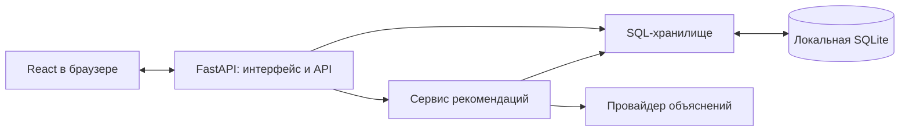

# Архитектура

Это один backend и один веб-интерфейс. В поставке FastAPI обслуживает и `/api`, и собранный React из `frontend/dist`. Браузер обращается к тому же origin, поэтому отдельные Vite и reverse proxy для локальной проверки не нужны. Разработка с Vite остаётся доступна.

| Модуль | Ответственность |
| --- | --- |
| `backend/application.py` | Фабрика приложения: зависимости, middleware, обработка ошибок, API и публичные статические файлы |
| `backend/api.py` | HTTP-маршруты, административная авторизация, входная валидация справочников |
| `backend/recommendations.py` | Получение снимка, проверка запроса, отбор, объяснения и повторное чтение после изменения каталога |
| `backend/recommender.py` | Детерминированные фильтры, порядок и альтернативы |
| `backend/storage.py` | SQL-транзакции, импорт, снимки, модерация, ревизии и журнал |
| `backend/explainer.py` | Вызов модели, валидация выбранных фактов, кеш и резервный режим |
| `backend/runtime.py` | Пути к ресурсам, настройкам и изменяемым данным |
| `backend/launcher.py`, `run.py` | Один локальный сервер, первый конфиг, открытие браузера и обработка занятого порта |
| `backend/app.py` | Совместимый вход для `uvicorn backend.app:app` |

Импорт фабрики приложения не открывает SQL-файл и не создаёт настройки. Тесты создают приложение явно с временной базой. Синхронное чтение SQLite внутри асинхронного сервиса рекомендаций вынесено в рабочий поток, чтобы ожидание блокировки БД не останавливало обработку остальных HTTP-запросов.

## Данные и поставка

Ресурсы поставки — собранный интерфейс и исходный CSV — неизменяемы. В Windows EXE они находятся внутри `_internal`; рабочая база и `.env` находятся отдельно в `%LOCALAPPDATA%\SatContractors`. `SAT_DATA_DIR` или `--data-dir` выбирает другую папку состояния. В исходниках по умолчанию используются `data/catalog.sqlite3` и `backend/.env`.

Относительные `DATABASE_PATH`, `CONTRACTORS_CSV`, `SAT_FRONTEND_DIR` разрешаются от корня исходников, а в EXE — от папки состояния. Путь больше не зависит от каталога, из которого запущен процесс. `SAT_DATA_DIR` задаётся до запуска, поскольку определяет местоположение самого `.env`.

В HTTP монтируется только `frontend/dist`. Код backend, CSV, `.env` и SQL-файл не публикуются. Неизвестный API-путь остаётся 404 и не превращается в HTML страницы. Hash-маршруты интерфейса `/#/apply`, `/#/admin` не требуют серверного перенаправления всех URL на index.html.

## Осознанные ограничения

- SQL-снимок содержит все одобренные профили: для текущего каталога это небольшой объём. Для большого каталога фильтрацию и пагинацию поиска следует перенести в SQL.
- Общий секретный код администратора используется для демонстрации; персональные учётные записи и роли не реализованы.
- Нет автоматических миграций между будущими версиями схемы; текущая версия SQLite явно проверяется.
- Поставляемый EXE предназначен для Windows x64. Для другой ОС нужна отдельная сборка.
- Публичный интернет-хостинг отдельно требует настройки HTTPS и эксплуатационных ограничений; локальный launcher слушает только 127.0.0.1.

Основа реализации: [FastAPI StaticFiles](https://fastapi.tiangolo.com/tutorial/static-files/), [пути ресурсов PyInstaller](https://pyinstaller.org/en/stable/runtime-information.html).
